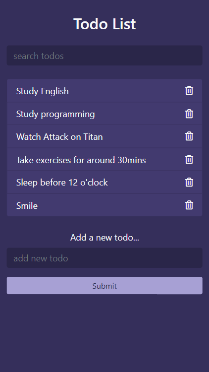

# JavaScript project - Todo

This is a JavaScript project to store, delete, and add to-do lists. 

### Website
[Todo](https://gitaccsithu.github.io/Todo/)

## Table of contents

- [Overview](#overview)
  - [Usability](#Usability)
  - [Screenshots](#screenshots)
- [My process](#my-process)
  - [Built with](#built-with)
  - [Details about the project](#Details-about-the-project)
- [Author](#author)

## Overview

### Usability

Users can:

- Add a new to-do list
- Delete to-do lists
- Search to-do lists

### Screenshots

- Desktop

- Mobile

## My process

### Built with

- Vanilla JavaScript
- Bootstrap
- Semantic HTML5 markup

### Details about the project

This project is a Vanilla JavaScript project called "Todo". In this project, I used Vanilla JavaScript, HTML, CSS, and Bootstrap. Users can able to add a new to-do list by 
entering their to-do jobs inside the "add a new to-do" input. Then they can submit either with submit button or by pressing enter. Then a new to-do list will add 
to the DOM. Users can also delete the to-do lists by clicking the trash can icon from each to-do list. The "search todos" input field allows the users to be able to 
search the specific to-do list which they want to search from the whole list. This website is responsive in both desktop and mobile views. 

## Author

- Developer Name - Sithu Myo Set
- Mail - [Sithu Myo Set](sithuzx123@gmail.com)
- Facebook - [Sithu Myo Set](https://www.facebook.com/profile.php?id=100007418655004)

